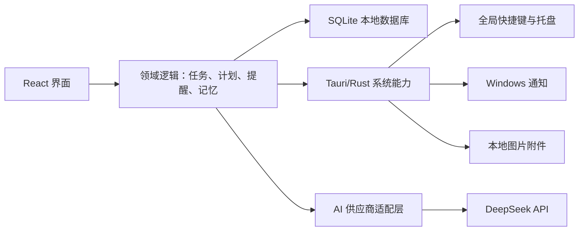

# 技术架构基线

## 暂定技术栈

- 桌面壳：Tauri 2；
- 界面：React + TypeScript；
- 系统层：Rust；
- 本地数据：SQLite + 版本化迁移；
- 自动化测试：前端单元测试、Rust 测试、关键流程端到端测试；
- AI：供应商适配层，第一家接 DeepSeek Chat Completions API。

选择 Tauri 的核心原因是它已有 Windows 全局快捷键、通知和 SQLite 官方插件，同时保留后续移动端复用部分领域逻辑的可能。移动端仍需单独设计交互，不能把“框架支持移动端”当作手机版本已经解决。

当前代码只实现了 React + TypeScript + Vite 浏览器原型。Tauri、Rust、SQLite 和 DeepSeek 是目标架构，不是当前已经存在的模块。

当前任务、项目、快捷记录组合键以及 AI 供应商表单都只保存在 React 组件状态中，没有使用 `localStorage`、IndexedDB 或 SQLite。进入本地数据阶段前必须先决定：用可替换的浏览器持久化适配器验证数据接口，还是提前引入最小 Tauri/SQLite 承载层；该决定尚未作出。

官方依据（核验于 2026-08-05）：

- [Tauri 全局快捷键](https://v2.tauri.app/reference/javascript/global-shortcut/)
- [Tauri 通知](https://v2.tauri.app/reference/javascript/notification/)
- [Tauri SQL/SQLite](https://v2.tauri.app/plugin/sql/)
- [DeepSeek Chat Completion](https://api-docs.deepseek.com/api/create-chat-completion)
- [DeepSeek 多轮对话说明](https://api-docs.deepseek.com/guides/multi_round_chat)

## 架构边界

- UI 不直接拼 SQL，也不直接持有 API Key。
- 领域逻辑不依赖具体页面，未来手机端可复用数据定义和规则。
- 系统能力集中在 Rust/Tauri 层，快捷键失败、通知权限和文件错误要返回可解释状态。
- AI 适配层接受统一请求，返回结构化结果；更换模型不改任务核心代码。

## 数据模型

| 表 | 关键字段 | 用途 |
|---|---|---|
| `tasks` | id、title、notes、status、bucket、planned_date、due_at、reminder_at、repeat_rule、important、urgent、project_id | 任务主数据；repeat_rule 首版为 once/daily；important/urgent 在收集箱可为空，整理后为明确的是/否 |
| `projects` | id、name、status、color | 项目归属 |
| `attachments` | id、task_id、file_name、local_path、mime_type、sha256、created_at | 本地图片与完整性 |
| `reminder_events` | task_id、scheduled_at、fired_at、action、dedupe_key | 防止漏发和重复提醒 |
| `task_steps` | task_id、text、position、completed_at、source | 手动或 AI 生成步骤 |
| `ai_runs` | task_id、provider、model、request_scope、result、status、created_at | 可审计 AI 调用，不保存密钥 |
| `memory_entries` | source_type、source_id、content、enabled、created_at、deleted_at | 用户可管理的长期记忆 |
| `settings` | key、value | 非敏感设置；密钥不得进入此表 |

时间统一存 UTC，界面按系统时区显示；纯“计划哪一天”使用本地日期，避免时区换算把任务移到前一天。

当前浏览器原型仅在内存中保存 `repeatRule`。进入持久化前必须确认每天重复任务完成后的实例策略，再决定是为每次发生生成独立记录，还是维护规则与发生记录；不得直接通过重置同一行来掩盖历史。

快捷记录组合键、AI 供应商、请求地址和模型属于可进入普通设置存储的非敏感配置；API Key 必须单独进入 Windows 受保护凭据。桌面受保护存储尚未具备前，API Key 只能停留在当前页面内存，不能为了“看起来能保存”改用浏览器普通存储。

四象限映射固定为：`important=false, urgent=true`＝紧急不重要；`true, false`＝重要不紧急；`true, true`＝紧急且重要；`false, false`＝不紧急不重要。`null` 只表示收集箱中的“未分类”，不能算作第四象限。

## 快捷记录与附件

- 默认快捷键暂定 `Ctrl+Alt+Space`，必须可修改并检测占用。
- 图片从剪贴板读取后复制到应用数据目录，使用随机文件名；数据库保存原名、类型、大小和 SHA-256。
- 数据库写入与附件落盘要么全部成功，要么保留可恢复草稿，不能出现界面显示保存但附件已经丢失。

## 提醒策略

应用关闭主窗口后留在系统托盘，后台调度提醒。启动、系统唤醒和日期变化时重新查询数据库。通知事件使用唯一键去重，并保留“已触发/稍后提醒/已完成”的事件记录。

如果用户彻底退出托盘进程，首版无法保证定时通知；退出时要明确提示这一后果。开机自启属于用户可配置能力，不静默开启。

## DeepSeek 与个人记忆

DeepSeek 接口本身不替应用长期保存上下文；应用需要挑选上下文并随请求发送。因此“记忆”必须首先是本地、可检查的数据，而不是把全部历史对话不断拼接上传。

- 默认模型尚未确定。进入真实 AI 阶段时重新核验 DeepSeek 官方当前可用模型，并通过设置或供应商适配层配置，不把模型名写死在任务业务代码中。
- API Key 放入 Windows 受保护凭据，不写进数据库或前端持久化状态。
- 供应商、请求地址和模型属于非敏感配置，可通过设置层保存；API Key 必须与这些字段分离并交给 Windows 受保护凭据。当前浏览器原型只在组件内存中暂存全部表单值，刷新即清空，且不执行网络请求。
- 请求只包含当前任务、用户确认的项目摘要和有限记忆；记录发送范围，不记录密钥。
- 强制结构化输出并做本地校验；失败时展示原始任务和手动第一步输入框。

## 当前环境预检

2026-08-08 当前工作区包含 `onestep-app/` 浏览器原型和完整项目文档。已知环境：Node `v24.18.0`、`npm.cmd 11.16.0` 可用；PowerShell 直接运行 `npm` 会被执行策略拦截，应使用 `npm.cmd`。本轮仍未找到 `rustc`、`cargo`、`cl`、`vswhere`；收尾复核时已在 `HKLM\SOFTWARE\WOW6432Node\Microsoft\EdgeUpdate\Clients` 找到 Microsoft Edge WebView2 Runtime `151.0.4129.72`。

进入 Windows 桌面化前必须重新核验全部前置条件，并在获得用户许可后补齐 Rust 与 Windows C++ Build Tools；WebView2 虽已登记安装，仍要通过实际桌面构建确认可用。不得把安装成功直接视为应用可构建，仍要完成一次开发构建和一次安装包构建。
